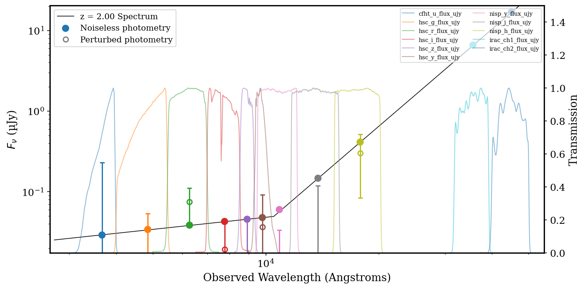
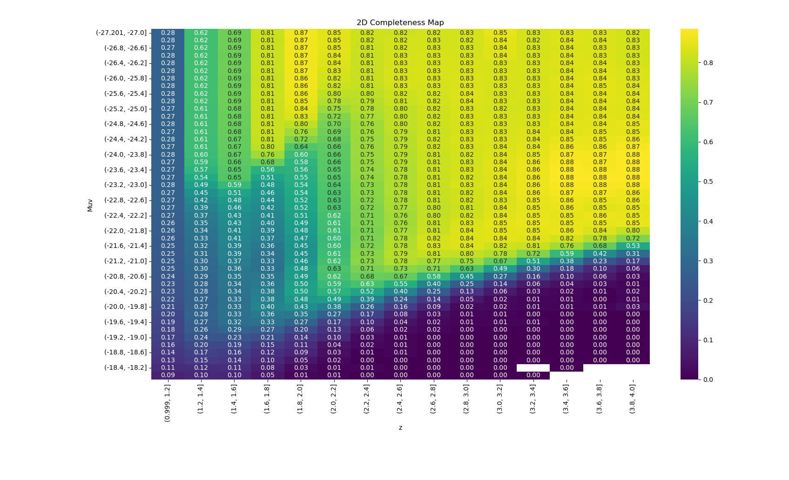

# Completeness Simulations

## Overview 

The discovery of compact red galaxy candidates in data from the James Webb Space Telescope has opened new avenues for studying galaxy formation in the early universe. Understanding whether similar populations exist at lower redshifts is critical for constraining galaxy evolution models and assessing the physical nature of these sources.

This work supports research efforts at the University of Texas at Austin to characterize the abundance of LRD-like galaxies in the nearby universe. In particular, undergraduate researcher Hannah Lawson is conducting a systematic search for these objects and investigating their population statistics.

Completeness simulations are essential because observational surveys are inherently incomplete. Instrumental sensitivity limits, noise properties, and selection criteria can introduce biases that distort inferred galaxy abundance measurements. By modeling detection efficiency across astrophysical parameter space, this project enables:

- More accurate population abundance estimates
- Quantification of selection biases
- Improved survey selection strategies
- Robust statistical interpretation of observational data

Ultimately, this analysis contributes to understanding whether LRD-like sources represent a distinct galaxy population or are manifestations of known astrophysical processes observed under specific conditions.

## Method

To evaluate survey completeness, we generate mock spectra with spectral energy distributions resembling LRD candidates.

Synthetic sources are simulated across a range of physical parameters including:

- Absolute UV brightness
- Redshift
- Spectral slope and continuum shape

These mock sources are injected into the analysis pipeline to assess:

- Detection sensitivity as a function of source properties
- Regions of parameter space where LRD-like sources are missed
- Potential improvements to selection criteria

The simulation suite explores a multidimensional grid of astrophysical and observational parameters to ensure comprehensive coverage of plausible source characteristics. An example of the generated spectrum can be seen below where we model the brightness, redshift and the UV and Optical beta slopes. 

The end result of this is that many realizations for a wide combination of brightness, redshifts and UV and Optical beta slopes are generated. We then pass these into a photometric redshift code to see if we are able to recover these sources as LRDs. Using a separate completeness correction code we are able to quantify the completeness with regards to LRDs in a sample as a function of brightness Muv and redshift. 

